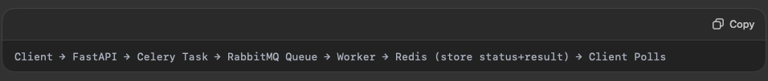
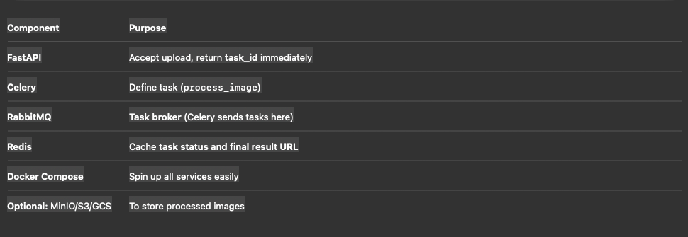
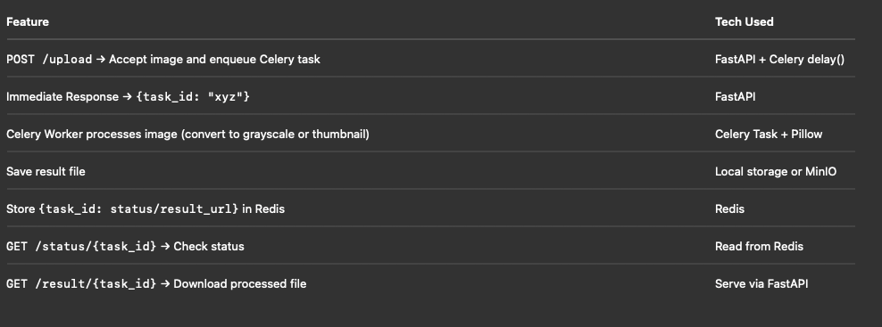
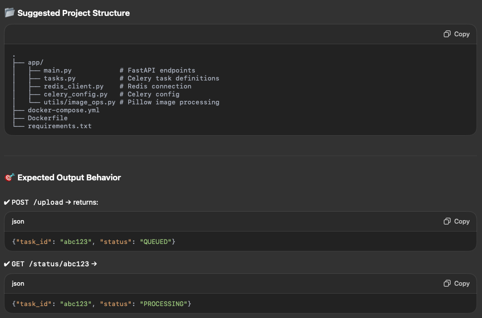
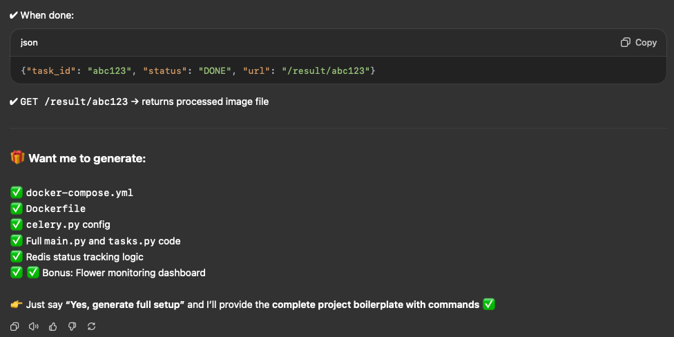

Async Image Processing Pipeline with FastAPI + Celery + RabbitMQ + Redis

📌 Goal

Build an API where users upload an image, and instead of processing immediately (blocking), you queue the job with Celery → RabbitMQ.
While the task runs asynchronously, store status in Redis, and allow the user to poll status or retrieve the processed image later.

⸻

⚙️ Architecture Flow

🛠️ Features to Implement

🚀 Bonus: Real DevOps Behavior
	•	Use Docker Compose to spin:
	•	fastapi-app
	•	celery-worker
	•	rabbitmq
	•	redis
	•	Track Celery dashboard via Flower UI
	•	Optionally, set retry policy with exponential backoff

Using UV package manager here